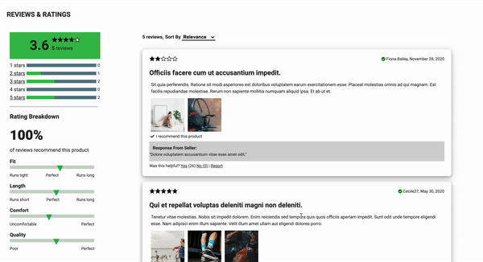

# Patagucci E-Commerce Products Page

Deployed Link: http://ec2-54-183-197-131.us-west-1.compute.amazonaws.com:3000/

## Description

Patagucci is a E-commerce products page that displays apparel products. The page is divided into four sections, products overview and products carousel (top), questions and answers(middle), and reviews and ratings(bottom). I was responsible for the reviews and ratings module.

## Getting Started

### Dependencies

* Front End: React, JavaScript
* Back End: Node, Express
* Deployment: AWS EC2
* Testing: Jest, Enzyme

## Authors

Jack Zhen
